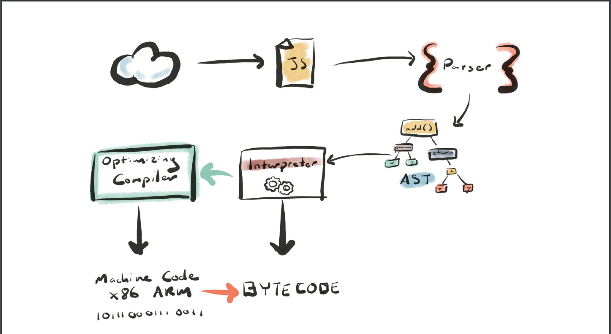
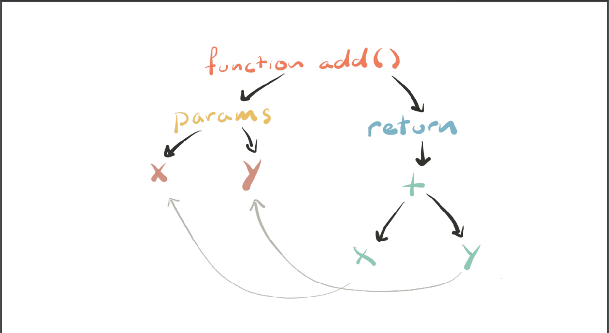
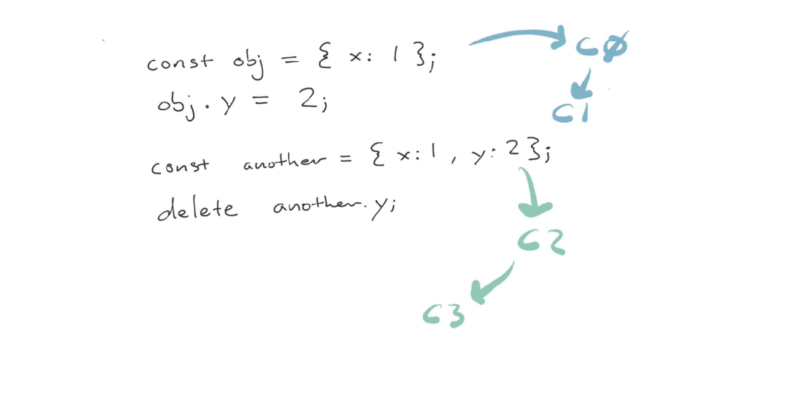
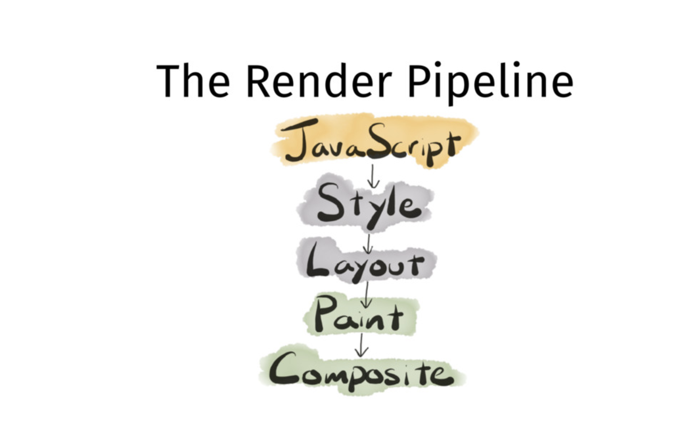

# Web Performance

## Javascript Performance

Javascript is compiled language.
Most browsers use something called **just-in-time (JIT) compilation** (JS is compiled just before it's about to be used).

How it works under the hood.

1. Javascript get send to a browser
2. Files go to the parser
3. Parser turns the code into _AST_
4. That AST goes to the _baseline compiler_
5. _Base compiler_ turns stuff into byte code

There is also second compiler (optimizing compiler).
Any code that can be optimized goes there. That optimizing compiler spits out machine code.



### Parsing

Parsing can be very slow.
You should always strive to defer as much parsing as possible.

- eager parsing: parse everything
- lazy parsing: do the bear minimum

```javascript
const a = 1;
const b = 2;
// Wrapping something in parenthesis tells the parser to parse it immediately
(function add(a, b) {
  return x + y;
});
add(a, b);
```

Try to avoid nested functions (this is micro-optimization, take it with a grain of salt)

```js
function sumOfSquares(x, y) {
  // 👇this will  repeatedly be parsed
  function square(n) {
    return n * n;
  }
  return square(x) + square(y);
}

// move the inner function out
function square(n) {
  return n * n;
}
```

### ASTS and Initial Execution

AST is a structure that shows a structure of the actual code.



### Optimizing Compiler

_Turbofan_ optimizes code in Chrome. We want to push as much code from _Interpreter_ to _Turbofan_

#### Measuring performance

```js
// Node 8+
const { performance } = require("perf_hooks");

// SETUP 🏁

let iterations = 1e7;

const a = 1;
const b = 2;

const add = (x, y) => x + y;

performance.mark("start");

while (iterations--) {
  add(a, b);
}

performance.mark("end");

performance.measure("My Special Benchmark", "start", "end");

const [measure] = performance.getEntriesByName("My Special Benchmark");
console.log(measure);
```

How do we know if our code went to _optimizing-compiler_?
We can use multiple flags to check it out.

- `node --trace-opt js_file.js`

Code above shows a function which is only used when to add **numbers**.
What would happen if we did this?

```js
...code...
while (iterations--) {
  add(a, b);
}
add('some', 'string')
...code...
```

Run with: `node --trace-deopt --trace-opt`

Well sadly our function got optimized and with the addition of `add('some', 'string')` got deoptimized.

Deoptimizing a function can make it run significantly slower.

You can also use special native-syntax to manipulate optimizations.

```js
...code...
%NeverOptimizeFunction(add)
// or
%OptimizeFunctionOnNextCall(add)
...code...
```

You have to run it with `--allow-natives-syntax`

So the great news is that any tool that allows you to enforce types will effectively speed up your application by allowing for these optimizations to occur faster.

#### Underlying Compiler Types

**Objects can be:**

- Monomorphism: same thing every time
- Polymorphism: generally the same but sometimes mixed bag
- Megamorphism: compiler will not optimize this, wild west of structures

So, how does the browser figure out what type something is?

You can use `%HaveSameMap(obj1, obj2)%` to check if object are 'the same' _compiler type wise_

#### Hidden Classes

- dynamic lookup: this object could be anything, so let me look at the rule book and figure it out (it's slow).

There is secret type system behind your back.

Everything gets something called **hidden class**.
Here is how it looks like in practice.

The c0,c1 ... are those hidden classes (in reality there are long strings). Therese strings are used for lookup when we are accessing a property. They help compiler to optimize for not doing the lookup process again.

#### Scoping and Prototypes

```js
const makeAPoint = () => {
  class Point {
    constructor(x, y) {
      this.x = x;
      this.y = y;
    }
  }
  return new Point(1, 2);
};
const a = makeAPoint();
const b = makeAPoint();
console.log(%HaveSameMap(a,b)) //false
```

Every time we invoke `makeAPoint` we are creating a fresh reference to a different prototype (see how classes work)
That's why this code is significantly slower than the other case where we would move class definition outside the function.

#### Function inlining

```js
const square = x => x * x;
// which is faster
// (1) this ?
const sumOfSquares = (a, b) => square(a) + square(b);
// (2) or maybe this ?
const sumOfSquares = (a, b) => a * a + b * b;
```

Of course (2) is faster. But does that mean you cannot write functions the (1) way?
Turns out we have this thing called _function inlining_. Optimization compiler can inline functions on your behalf.

### Takeaways

> - The easiest way to reduce parse, compile, and execution times is to ship less code.
> - Use the **User Timing API** to figure out where the biggest amount of hurt is.
> - Use type system if you can to help with hidden classes and optimizations

## Rendering performance

Browser sends request for a (lets say HTML now) to a server with a _GET_ request.
Server responds with a HTML file (which probably has also styles and js files).

- HTML gets parsed do a DOM (**D**ocument **O**bject **M**odel)
- CSS gets parsed to a CSSOM (**CSS** **O**bject **M**odel)
- JS gets parsed to **AST** tree (see sections above)

Parts what will actually show up on the page are turned into **Render Tree**

###### Style calculation

Browser figures out all of the styles that will be applied to a given element.

As a rule of thumb stick to simple class names whenever possible. **Consider using BEM** (this one is huge, I have to familiarize myself with it one day)

### Rendering Pipeline


You do not always have to go through all of those steps. You can skip some of the parts (for example animating transform or opacity).

### Layouts and reflows

- Reflow: things have changed, I need to update Layout

Layout (reflows) **are really really expensive**

> Whenever the geometry of an element changes, the browser has to reflow the page.

#### About reflow

- reflow is a block operation
- consumes a decent amount of CPU
- will be noticeable by the user
- a reflow of an element causes a reflow of it's parent and children ☠️

Generally speaking **a reflow is followed bt a repaint**. Repaint is **the most expensive operation**

#### Layout thrashing

> Layout thrashing occurs when JS violently writes, then reads, from the DOM, multiple times causing document reflows

Lets say we have 10 elements which we want to double in width.
We can try this naive implementation:

```js
for (let element of elements) {
  let width = element.offsetWidth;
  element.offsetWidth = width * 2;
}
```

The snipped above will cause _Layout thrashing_. We are reading and writing multiple times.

Much better implementation would be **reading all the widths first then making elements wider.** This way browser can batch operations and optimize stuff.

```js
const widths = elements.map(element => element.offsetWidth);
for (i = 0; i < widths.length; i++) {
  elements[i].offsetWidth = widths[i] * 2;
}
```

_FastDOM_ can help you with batching and stuff when optimizing for layout trashing

#### Frameworks and Layout Trashing

Frameworks carry a bag of performance issues on their own, but they can optimize stuff using the latest and greatest techniques and algorithms (many smart people work on them). Just important to **measure using production build**.
