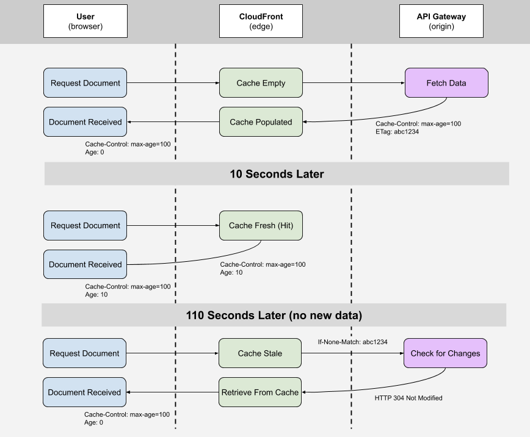

# Http Caching

While working with _React_ or other frameworks you might get caught up in thinking only about the _client side_ cache.
Libraries like _react-query_ and _apollo client_ make caching on the client easy.
But we can do more, we can cache our data on the _http_ layer as well.

## `max-age` header

There are many _http cache headers_ but this one is by far the most important one. This will **give a hint** to a browser on how **long should given object live in cache**.
Now, this is a hint, not a demand, not something authoritative. You might end up in a situation where that object will not be cleared at all, but more on that later.
All you have to do is to set the header, here is an example in `nodejs`

```js
const http = require("http");

const server = http.createServer(function requestListener(request, response) {
  response.setHeader("content-type", "text/html");
  response.setHeader("cache-control", "max-age=10");
  response.writeHead(200);
  response.end("<div>works</div>");
});

server.listen(3000);
```

**Remember to enable browser cache and make sure you are not using hard reload**.

With this simple header we are able to cache some content for some period of time, after that time expires, **without any additional changes**, browser will request the resource again.

## `ETag` header

`ETag` header is there as a **mechanism to tell the browser that the content is still the same**. I think this image tells the whole story:



You can send whatever really, as long as you can determine if the content changed or not.
Browser will send you back the `If-None-Match` header after the `max-age` is expired.

If the `ETag` is different - you send the resource along with new set of headers, otherwise you just return with _304_ status code.

Here is the `nodejs` sample

```js
const http = require("http");

const server = http.createServer(function requestListener(request, response) {
  if (
    request.headers["if-none-match"] &&
    request.headers["if-none-match"] === "1"
  ) {
    response.writeHead(304);
    response.end("");
  } else if (request.url === "/") {
    response.setHeader("content-type", "text/html");
    response.setHeader("ETag", "1");
    response.setHeader("cache-control", "max-age=10");
    response.writeHead(200);
    response.end("<div>works</div>");
  } else {
    response.setHeader("content-type", "text/html");
    response.end("<div>works2</div>");
  }
});

server.listen(3000);
```

So easy right? Now imagine what you can do with _GraphQL_ and other stuff.

## `max-age` on the CDN level

If you are doing any kind of _Static Site Generation_ you might have faced a problem where your customers are getting stale data even though you changed the content. This is probably because you set a high `max-age` header because your content is, well, static.

While having a high `max-age` for things that literally do not change is a good strategy, it will not necessarily work well with SSG. What you want to do is to set relatively short `max-age` on the browser level and a long `max-age` on the CDN level, where you have the ability to purge the content from the cache.

This way you basically have best of two worlds.

- Your content is cached so your visitors are getting the content in a fastly manner
- You have the ability to purge entry from CDN cache

To make it all work, you will need to use the `s-maxage` header. This is the header which only CDN understands, it allows you to difference between browser cache (`max-age`) and CDN cache (`s-maxage`).

The workflow you presumably look as follows

1. You build your static sites
2. You introduce a cache in the content to some of them
3. You purge existing entries in CDN which correspond to the pages you have changed
4. You deploy your changes
